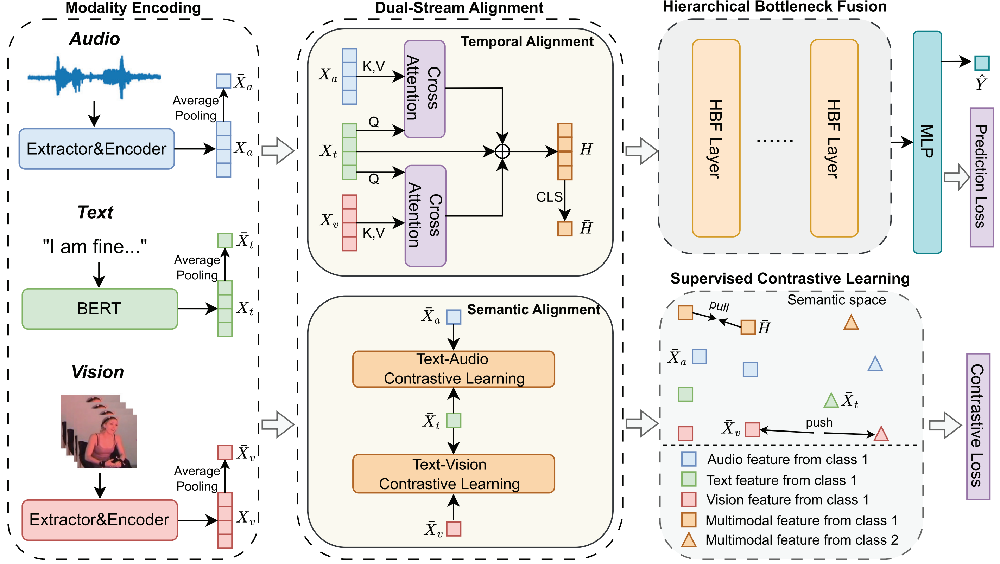

# DashFusion: Dual-stream Alignment with Hierarchical Bottleneck Fusion for Multimodal Sentiment Analysis (IEEE T-NNLS 2025)

Code for the paper "**DashFusion: Dual-stream Alignment with Hierarchical Bottleneck Fusion for Multimodal Sentiment Analysis**". [paper](https://arxiv.org/abs/2512.05515)

## ✨ Overview

**DashFusion** is a novel framework for multimodal sentiment analysis (MSA), which contains dual-stream alignment with hierarchical bottleneck fusion. First, the dual-stream alignment module synchronizes multimodal features through temporal and semantic alignment. Temporal alignment employs cross-modal attention (CA) to establish frame-level correspondences among multimodal sequences. Semantic alignment ensures consistency across the feature space through contrastive learning. Second, supervised contrastive learning (SCL) leverages label information to refine the modality features. Finally, hierarchical bottleneck fusion (HBF) progressively integrates multimodal information through compressed bottleneck tokens, which achieves a balance between performance and computational efficiency.



## 📌 Repo Structure

```
DashFusion/
├── figure/
├── src/
│   ├── ckpt/               # save checkpoints
│   ├── dataset/            # data path
│   ├── dataloader/            
│   │   ├── mosi.py
│   │   ├── mosei.py          
│   │   └── sims.py
│   ├── log/                # save training logs
│   ├── model/
│   │   ├── audio_encoder.py       # audio encoder 
│   │   ├── dashfusion.py          # whole dashfuison model
│   │   ├── layers.py              # sublayer, such as attention, cross-attention, Multi-CA, hierarchical bottleneck fusion
│   │   ├── MLP.py                 # projector & classifier
│   │   ├── text_encoder.py        # text encoder
│   │   └── vision_encoder.py      # vision encoder
│   ├── result/             # save final results
│   ├── config.py           # hyperparameter & setting
│   ├── main.py             # main.py
│   ├── train.py            # train pipleine    
│   └── utils.py            # utils
├── requirements.txt
```

## 🔨 Installation

Dataset: The dataset is available for download at https://github.com/thuiar/MMSA

Environment: Our code is built on python version 3.9 & pytorch version 1.13.1.

```
conda create -n dashfusion python=3.9
conda activate dashfusion
git clone https://github.com/ultramarineX/DashFusion/
cd DashFusion
pip install -r requirements.txt
```

## 🚀 Quick Start

Choose the dataset in config.py, and then run main.py.

```
python main.py
```

### NOTE

In paper section IV.D, we made a mistake that the layer of transformer encoders in audio and vision encoder. In fact, for MOSI and SIMS, the layer is 2, for MOSEI, the layer is 4. These errors have been corrected in the config.py file.

## ✏️ Citation

```
@ARTICLE{wen2025dashfusion,
  author={Wen, Yuhua and Li, Qifei and Zhou, Yingying and Gao, Yingming and Wen, Zhengqi and Tao, Jianhua and Li, Ya},
  journal={IEEE Transactions on Neural Networks and Learning Systems}, 
  title={DashFusion: Dual-Stream Alignment With Hierarchical Bottleneck Fusion for Multimodal Sentiment Analysis}, 
  year={2025},
  volume={36},
  number={10},
  pages={17941-17952},
  doi={10.1109/TNNLS.2025.3578618}}
```

## 👍 Acknowledgements

Thanks for the efforts of all the authors.

Part of the code is borrowed from the following repos. We would like to thank the authors of these repos for their contribution.

 - https://github.com/thuiar/MMSA
 - https://github.com/XpastaX/ConFEDE
 - https://github.com/Haoyu-ha/ALMT

## ☎️ Contact

If you have any problems regarding the paper, code, models, or the project itself, please feel free to open an issue or contact me at yuhuawen@bupt.edu.cn
